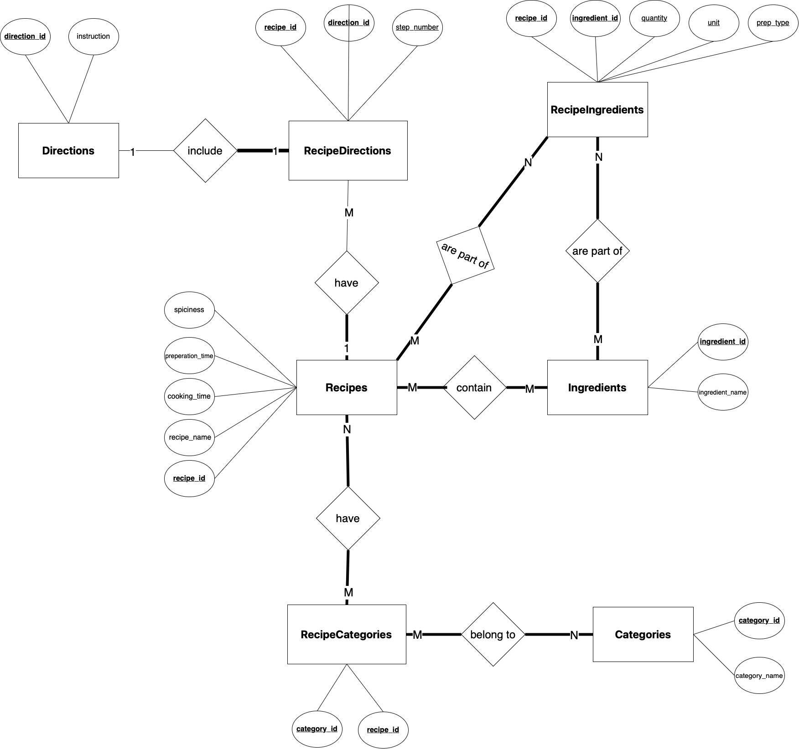

# Recipe Database Prep Exercise

## EER Diagram with Chen Notation

### Entities

#### Recipes Entity
- **Primary Key**: `recipe_id`
- **Attributes**: `recipe_name`, `cooking_time`, `preparation_time`, `spiciness`

Recipes table captures the core details of each recipe, including its name, cooking time, preparation time, and spiciness level. The `recipe_id` serves as the unique identifier for each recipe, ensuring that no two recipes in the table have the same ID.

#### Recipe Categories Entity
- **Primary Key**: `(recipe_id, category_id)`
- **Foreign Keys**: `recipe_id` (References Recipes), `category_id` (References Categories)

Recipe Categories has a composite primary key, as indicated by the `PRIMARY KEY (recipe_id, category_id)` statement. This means that the combination of `recipe_id` and `category_id` together uniquely identify each row in the table. Both columns are also foreign keys, meaning they reference other tables (Recipes and Categories respectively). This structure implies that each recipe can belong to multiple categories, and each category can have multiple recipes associated with it.

#### Categories Entity
- **Primary Key**: `category_id`

Categories entity has the core details of each category, including its name and unique identifier (`category_id`). Each category is uniquely identified by its `category_id`, and the `category_name` column stores the name of the category. This table can be used to categorize recipes in the Recipes table by associating them with specific categories.

#### Ingredients Entity
- **Primary Key**: `ingredient_id`

Ingredients entity captures the core details of each ingredient, including its name and unique identifier (`ingredient_id`). Each ingredient is uniquely identified by its `ingredient_id`, and the `ingredient_name` column stores the name of the ingredient. This table can be used to associate ingredients with recipes in the Recipes table, perhaps through a junction table that maps which ingredients are used in which recipes.

#### Recipe Ingredients Entity
- **Primary Key**: `(recipe_id, ingredient_id)`
- **Foreign Keys**: `recipe_id` (References Recipes), `ingredient_id` (References Ingredients)

The RecipeIngredients entity is used to represent the many-to-many relationship between recipes and ingredients. It allows for the possibility that each recipe can have multiple ingredients, and each ingredient can be used in multiple recipes. The table captures the specific details of each ingredient in a recipe, including the quantity, unit of measurement, and preparation type.

#### Recipe Directions Entity
- **Primary Key**: `(recipe_id, direction_id)`
- **Foreign Keys**: `recipe_id` (References Recipes), `direction_id` (References Directions)

RecipeDirections table is used to associate each step of a recipe with the recipe itself. The `step_number` column helps organize the steps in the correct sequence for the recipe. `recipe_id` is a reference to the recipe to which the direction belongs. `direction_id` is a reference to the specific direction step within the recipe. `step_number` attribute indicates the order in which the direction should be followed in the recipe. The combination of `recipe_id` and `direction_id` serves as the primary key for the RecipeDirections table. This means that together, these two columns uniquely identify each row in the table. For example, if a recipe has multiple steps, each combination of `recipe_id` and `direction_id` would represent a unique step for that recipe.

#### Directions Entity
- **Primary Key**: `direction_id`

Directions entity captures the core details of each direction or step in a recipe, including its unique identifier (`direction_id`) and the actual instruction or step (`instruction`). Each direction is uniquely identified by its `direction_id`, and the `instruction` column stores the instruction or step itself. This table can be used to associate directions with recipes in the RecipeDirections table, which maps which directions are used in which recipes.

### Relationships and Cardinalities

#### Recipes and Recipe Directions

- **Description**: Recipes must have recipe directions. One recipe can have multiple recipe directions, but one recipe direction can only be applicable to one recipe.
- **Relationship Type**: One-to-Many
- **Foreign Keys**: `recipe_id` (References Recipes), `direction_id` (References Directions)
- **Attributes**: `step_number`

#### Recipes and Recipe Categories

- **Description**: Every recipe must have one or more recipe categories, and every recipe category must belong to a recipe. They have a many-to-many relationship.
- **Relationship Type**: Many-to-Many
- **Junction Table**: RecipeCategories
- **Foreign Keys**: `recipe_id` (References Recipes), `category_id` (References Categories)

#### Recipe Categories and Categories

- **Description**: Every recipe category must belong to a category, and every category can have multiple recipe categories associated with it. They have a many-to-many relationship.
- **Relationship Type**: Many-to-Many
- **Junction Table**: RecipeCategories
- **Foreign Keys**: `category_id` (References Categories)

#### Recipe and Ingredients

- **Description**: Recipes must contain ingredients, and ingredients must belong to a recipe. A recipe should contain more than one ingredient. They have a many-to-many relationship.
- **Relationship Type**: Many-to-Many
- **Junction Table**: RecipeIngredients
- **Foreign Keys**: `recipe_id` (References Recipes), `ingredient_id` (References Ingredients)

#### Recipe Ingredients

- **Description**: This entity must be part of the Recipes and Ingredients entities.
- **Relationship Type**: Many-to-Many
- **Junction Table**: RecipeIngredients
- **Foreign Keys**: `recipe_id` (References Recipes), `ingredient_id` (References Ingredients)

#### Recipes and Recipe Directions

- **Description**: Every recipe must have more than one recipe direction, and recipe directions can belong to one recipe. Because they do not have a common recipe, they have a one-to-many relationship.
- **Relationship Type**: One-to-Many
- **Foreign Keys**: `recipe_id` (References Recipes)

#### Recipe Directions and Directions

- **Description**: Every direction must include a recipe direction, and every recipe direction must include a direction. They have a one-to-one relationship.
- **Relationship Type**: One-to-One
- **Foreign Keys**: `direction_id` (References Directions)
